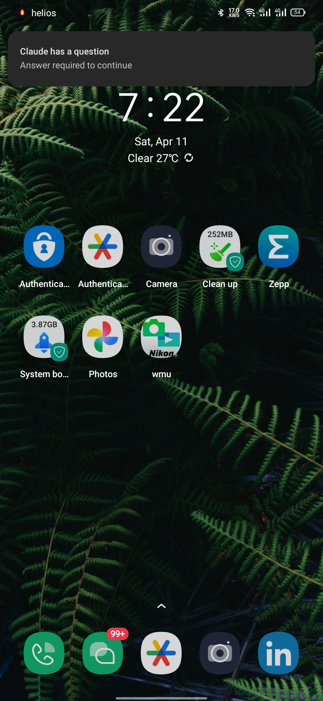
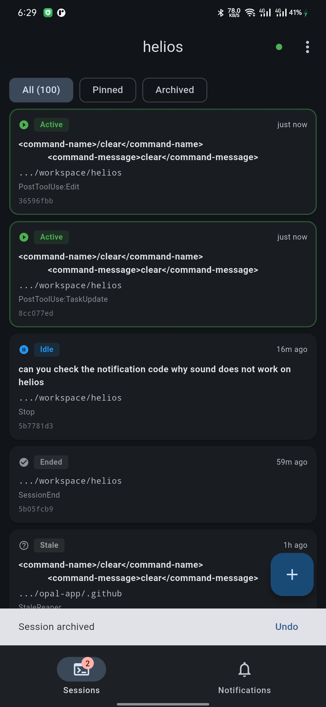
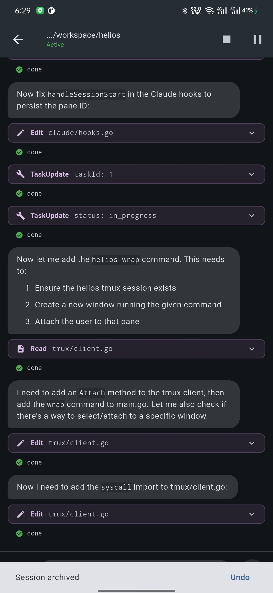
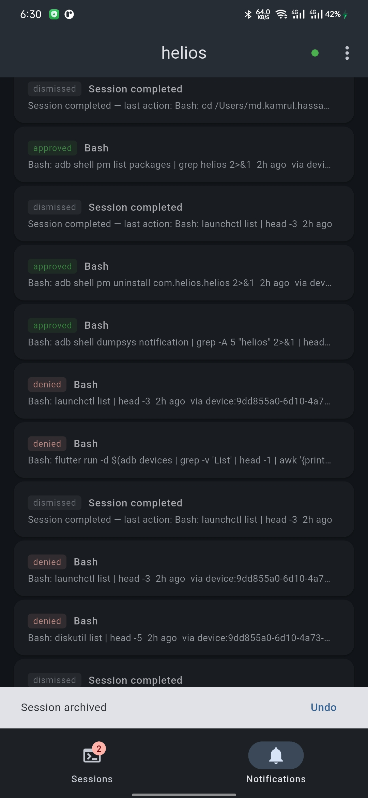
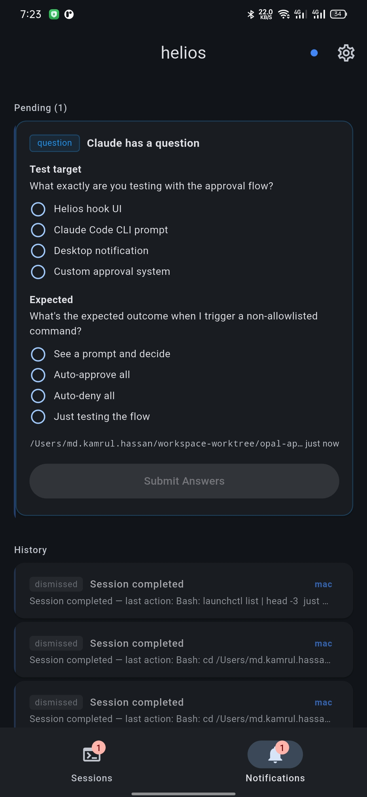

# helios

**A platform that orchestrates AI coding agents on your machine.**

You run 5 Claude sessions across 3 projects. One needs permission to run a test. Another finished refactoring and is waiting for your next instruction. A third hit a rate limit 20 minutes ago. You don't know any of this because you're in a different terminal tab.

Helios fixes this. It's a daemon that sits between you and your AI coding tools. It manages their sessions via tmux, watches for events via hooks, and notifies you the moment any session needs attention — on your desktop, your phone, your browser, wherever you are.

**The killer feature:** Claude needs permission → your phone buzzes → you tap approve → Claude continues. From one browser tab, you can see all your sessions, approve permissions in batch, send follow-up messages, and create new tasks — without touching the terminal.

```
      Phone                    Internet                   Your Machine
  ┌───────────┐          ┌──────────────┐          ┌──────────────────────┐
  │ Helios App│◀── HTTPS ──▶│   Tunnel   │◀─────────│   helios daemon      │
  │           │          │ (cloudflare)  │          │   ├── sessions       │
  │ sessions  │          └──────────────┘          │   ├── hooks          │
  │ approve   │                                    │   ├── notifications  │
  │ deny      │                                    │   └── tmux           │
  │ send msgs │                                    │       ├── claude #1  │
  └───────────┘                                    │       └── claude #2  │
                                                   └──────────────────────┘
```

## Setup Guide

### Prerequisites

```bash
brew install go tmux                # Go (build helios), tmux (session management)

# Pick ONE tunnel provider — exposes helios to your phone over the internet:
brew install cloudflared            # Cloudflare Tunnel (recommended, free, no account needed)
# or
brew install ngrok                  # ngrok (free tier, requires signup at ngrok.com)
```

### Step 1 — Install the binary

```bash
$ make install
```

```
┌──────────────────────────────────────────────┐
│  $ make install                              │
│  go build -o helios ./cmd/helios/            │
│  helios installed to /usr/local/bin/helios   │
└──────────────────────────────────────────────┘
```

### Step 2 — Start helios

```bash
$ helios start
```

The TUI checks your environment and walks you through setup:

```
┌──────────────────────────────────────────────┐
│                                              │
│  helios                                      │
│                                              │
│    ✓ Daemon running                          │
│    ✓ Claude hooks installed                  │
│    ✓ tmux installed (3.5a)                   │
│    ✗ No tunnel configured                    │
│    · No devices registered                   │
│                                              │
│    enter continue  q quit                    │
│                                              │
└──────────────────────────────────────────────┘
```

### Step 3 — Pick a tunnel

Your phone needs a way to reach your machine. Pick a tunnel provider:

```
┌──────────────────────────────────────────────┐
│                                              │
│  helios — Tunnel Setup                       │
│                                              │
│    How will your phone connect?              │
│                                              │
│    > Cloudflare Tunnel (recommended)         │
│      ngrok                                   │
│      Tailscale                               │
│      Local Network (no HTTPS)                │
│      Custom URL                              │
│                                              │
│    ↑/↓ navigate  enter select  q quit        │
│                                              │
└──────────────────────────────────────────────┘
```

### Step 4 — Main dashboard with QR codes

Once the tunnel connects, the dashboard shows two QR codes:

```
┌──────────────────────────────────────────────────────────┐
│                                                          │
│  helios                                                  │
│                                                          │
│    ✓ Daemon running                                      │
│    ✓ Claude hooks installed                              │
│    ✓ tmux (3.5a)                                         │
│    ✓ Tunnel: https://abc-xyz.trycloudflare.com           │
│                                                          │
│    · No devices connected yet.                           │
│                                                          │
│    Download app:                                         │
│    ┌─────────────────────────────────┐                   │
│    │  ▄▄▄▄▄▄▄ ▄▄ ▄ ▄▄▄▄ ▄▄▄▄▄▄▄    │                   │
│    │  █ ▄▄▄ █ ▄▀██▀▄▀▄  █ ▄▄▄ █    │  ← scan with      │
│    │  █ ███ █ ▀█▄▀ ▀█ ▄ █ ███ █    │    phone camera    │
│    │  █▄▄▄▄▄█ ▄ █▄▀ █ ▄ █▄▄▄▄▄█    │    to download     │
│    │  ▄▄▄▄▄ ▄▄▄▀▄ ▄▀  ▄ ▄ ▄ ▄ ▄    │    the app         │
│    │  █▄▄▄▄▄█ ▀▄▀▄ ▀▄  █▄▄▄▄▄▄█    │                   │
│    │  ▀▀▀▀▀▀▀ ▀ ▀▀ ▀ ▀▀ ▀▀▀▀▀▀▀    │                   │
│    └─────────────────────────────────┘                   │
│    https://abc-xyz.trycloudflare.com                     │
│                                                          │
│    Pair a new device:                                    │
│    ┌─────────────────────────────────┐                   │
│    │  ▄▄▄▄▄▄▄ ▄ ▄▄ ▄▄▄  ▄▄▄▄▄▄▄    │                   │
│    │  █ ▄▄▄ █ █▀▀▄█ █▀▄ █ ▄▄▄ █    │  ← scan from      │
│    │  █ ███ █ ██▀▄ ▀ ▀▄ █ ███ █    │    inside the      │
│    │  █▄▄▄▄▄█ █ ▀▄█▄█ ▄ █▄▄▄▄▄█    │    helios app      │
│    │  ▄▄  ▄ ▄▄▄▀ ▀▄▄ ▄▄ ▄ ▄ ▄ ▄    │                   │
│    │  █▄▄▄▄▄█ ▄▀▀█▄ ▀█  █▄▄▄▄▄▄█    │                   │
│    │  ▀▀▀▀▀▀▀ ▀▀ ▀ ▀▀▀  ▀▀▀▀▀▀▀    │                   │
│    └─────────────────────────────────┘                   │
│    Expires in 1:42  (auto-refreshes)                     │
│                                                          │
│    q quit                                                │
│                                                          │
└──────────────────────────────────────────────────────────┘
```

### Step 5 — Download the app (QR 1)

Scan the **Download QR** with your phone camera. It opens a landing page:

```
┌─────────────────────────┐
│ ┌─────────────────────┐ │
│ │ ◀  abc.trycloudfl.. │ │
│ └─────────────────────┘ │
│                         │
│                         │
│         Helios          │
│  Orchestrate AI coding  │
│  agents from your phone │
│                         │
│  ┌───────────────────┐  │
│  │                   │  │
│  │  Download for     │  │
│  │  Android          │  │
│  │  APK              │  │
│  │                   │  │
│  └───────────────────┘  │
│                         │
│  ┌───────────────────┐  │
│  │                   │  │
│  │  Download for     │  │
│  │  macOS            │  │
│  │  DMG              │  │
│  │                   │  │
│  └───────────────────┘  │
│                         │
│  ┌───────────────────┐  │
│  │ How to connect    │  │
│  │ 1. Download app   │  │
│  │ 2. Run helios     │  │
│  │    start          │  │
│  │ 3. Scan pairing   │  │
│  │    QR code        │  │
│  └───────────────────┘  │
│                         │
└─────────────────────────┘
```

### Step 6 — Pair your device (QR 2)

Open the Helios app and scan the **Pairing QR**:

```
┌─────────────────────────┐
│          helios          │
│                         │
│  ┌───────────────────┐  │
│  │                   │  │
│  │                   │  │
│  │   ┌───────────┐   │  │
│  │   │           │   │  │
│  │   │  CAMERA   │   │  │
│  │   │ VIEWFINDER│   │  │
│  │   │           │   │  │
│  │   │   [ ]     │   │  │
│  │   │           │   │  │
│  │   └───────────┘   │  │
│  │                   │  │
│  │                   │  │
│  └───────────────────┘  │
│                         │
│  Scan the QR code from  │
│  your terminal          │
│                         │
│  Run helios start in    │
│  your terminal to       │
│  generate a QR code     │
│                         │
│  Paste URL manually     │
│                         │
└─────────────────────────┘
```

### Step 7 — Approve the device

The app registers and waits. The terminal asks you to confirm:

```
┌─────────────────────────┐          ┌──────────────────────────────────────────────┐
│                         │          │                                              │
│  ┌───────────────────┐  │          │  helios — New Device                         │
│  │                   │  │          │                                              │
│  │  helios           │  │          │    A device wants to pair:                   │
│  │  Setting up...    │  │          │                                              │
│  │                   │  │          │      Name:     Android — Helios App          │
│  │  + Generating     │  │          │      Platform: Android                       │
│  │    keys...        │  │          │      KID:      a1b2c3d4-e5f6                 │
│  │  + Registering    │  │          │                                              │
│  │    device...      │  │          │    Allow this device?                        │
│  │  + Authenticating │  │          │                                              │
│  │  + Waiting for    │  │          │    y approve  n reject                       │
│  │    approval...    │  │          │                                              │
│  │                   │  │          └──────────────────────────────────────────────┘
│  │  ┌─────────────┐  │  │
│  │  │  Press "y"  │  │  │                       press y
│  │  │ in terminal │  │  │                          │
│  │  │ to approve  │  │  │                          ▼
│  │  └─────────────┘  │  │
│  │                   │  │          ┌──────────────────────────────────────────────┐
│  │       ⟳           │  │          │  helios                                      │
│  │                   │  │          │                                              │
│  └───────────────────┘  │          │    ✓ Daemon running                          │
│                         │          │    ✓ Claude hooks installed                  │
└─────────────────────────┘          │    ✓ tmux (3.5a)                             │
                                     │    ✓ Tunnel: https://abc-xyz.trycloud...     │
        Phone                        │                                              │
                                     │    * Android — Helios App  push:on  just now │
                                     │                                              │
                                     └──────────────────────────────────────────────┘

                                                    Terminal
```

### Step 8 — You're in

The app navigates to the dashboard. Start a session and control Claude from your phone:

```bash
$ helios new "fix the auth bug in login.go"
```

```
┌──────────────────────────────────────────────┐
│  Session started in tmux pane %1             │
│    cwd: /Users/you/workspace/myapp           │
│    Attach with: tmux attach -t helios        │
└──────────────────────────────────────────────┘
```

Claude asks for permission → your phone buzzes → you tap approve → Claude continues:

<p align="center">
  
</p>

Open the app to see all your sessions, drill into live session details, manage notifications, or answer Claude's questions — all from your phone:

<p align="center">
  
  
  
  
</p>

## What is this?

Helios is a **platform**, not a tool. It orchestrates AI coding agents on your local machine without requiring a remote environment. Everything runs on your hardware. Everything except the AI itself is free.

- **Daemon** — a background process that manages tmux sessions, handles AI hooks, serves an HTTP API with SSE for real-time events, and routes notifications to channels
- **Clients** — TUI, browser, CLI, Telegram, Slack — all stateless, all interchangeable, all talking to the same daemon over HTTP. Use one, use all, use none
- **Providers** — Claude Code is the first-class provider with native hook integration. But any AI tool that runs in a terminal (Aider, Codex, Gemini CLI) can be a provider plugin
- **Channels** — notification delivery plugins. ntfy for instant mobile push. Telegram for approve/deny from chat. Slack for team visibility. Or build your own

## Why?

AI coding agents are becoming the primary way developers work. But the tooling around them is stuck in "one terminal, one session, stare at it." That breaks down when you:

- Run multiple sessions and lose track of which ones need you
- Step away and miss a permission prompt that blocks everything
- Want to check on your AI's progress from your phone
- Need to approve 6 permissions across 3 sessions — one at a time, manually
- Want to hand a session a new task without context-switching back to the terminal

Helios treats AI sessions like infrastructure — something to be managed, monitored, and orchestrated, not babysat.

## Architecture

```
  CLI / TUI                                          Mobile / Desktop App
  (local machine)                                    (your phone or laptop)
       │                                                      │
       │ localhost                                             │ HTTPS
       │                                                      │
       ▼                                                      ▼
┌──────────────────────────────────────────────────────────────────────────────┐
│                              helios daemon                                   │
│                                                                              │
│  ┌─────────────────────────────────────┐  ┌────────────────────────────────┐ │
│  │  Internal Server (127.0.0.1:7654)   │  │  Public Server (0.0.0.0:7655)  │ │
│  │                                     │  │                                │ │
│  │  /internal/health                   │  │  GET  /          landing page  │ │
│  │  /internal/sessions                 │  │  GET  /download  APK file      │ │
│  │  /internal/device/create            │  │  POST /api/auth/pair           │ │
│  │  /internal/device/list              │  │  POST /api/auth/login          │ │
│  │  /internal/device/activate          │  │  GET  /api/auth/device/me      │ │
│  │  /internal/device/revoke            │  │  GET  /api/notifications       │ │
│  │  /internal/tunnel/start             │  │  POST /api/notifications/:id   │ │
│  │  /internal/tunnel/stop              │  │  GET  /api/sessions            │ │
│  │  /internal/logs                     │  │  GET  /api/sse  (realtime)     │ │
│  │  /hooks/permission (Claude hooks)   │  │                                │ │
│  └─────────────────────────────────────┘  └───────────────┬────────────────┘ │
│                                                           │                  │
│  ┌──────────┐  ┌──────────────┐  ┌────────────────────────┐                │
│  │  SQLite  │  │ Session      │  │  Tunnel Manager        │                │
│  │ helios.db│  │ Reaper       │  │  (cloudflare/ngrok/..) │                │
│  └──────────┘  └──────────────┘  └───────────┬────────────┘                │
│                                               │                              │
│                              tmux server      │                              │
│                    ┌─────────────┬─────────┐  │                              │
│                    │             │         │  │                               │
│               claude #1    claude #2  aider #3                               │
│               (session)    (session)  (session)                              │
└──────────────────────────────────────────────────────────────────────────────┘
                                                │
                                                │ tunnel
                                                │ (cloudflare/ngrok/tailscale)
                                                ▼
                                       ┌──────────────────┐
                                       │  Public Internet │
                                       │  https://abc.cf  │
                                       └────────┬─────────┘
                                                │
                                     ┌──────────┴──────────┐
                                     │                     │
                            ┌────────┴───────┐   ┌────────┴───────┐
                            │  Mobile App    │   │  Desktop App   │
                            │  (Android)     │   │  (macOS)       │
                            │                │   │                │
                            │  Sessions      │   │  Sessions      │
                            │  Notifications │   │  Notifications │
                            │  Approve/Deny  │   │  Approve/Deny  │
                            │  SSE realtime  │   │  SSE realtime  │
                            └────────────────┘   └────────────────┘
```

```
┌─────────────────────────────────────────┐
│           File Layout (~/.helios/)       │
│                                         │
│  ~/.helios/                             │
│  ├── config.yaml      ← server config  │
│  ├── helios.db        ← SQLite (devices,│
│  │                      sessions, etc.) │
│  ├── daemon.pid       ← running PID    │
│  ├── helios.apk       ← built APK copy │
│  └── logs/                              │
│      └── daemon.log   ← daemon logs    │
│                                         │
│  ~/.claude/settings.json                │
│      └── hooks: [...helios hooks...]    │
│                                         │
└─────────────────────────────────────────┘
```

## Status

**Spec phase** — see `docs/specs/` for design documents.

## Spec Documents

| Doc | Description |
|-----|-------------|
| [01-concept.md](docs/specs/01-concept.md) | Vision, problem statement, design principles |
| [02-tui-design.md](docs/specs/02-tui-design.md) | TUI layout, sidebar, tabs, mouse support |
| [03-notifications.md](docs/specs/03-notifications.md) | Notification system: hooks, toasts, panel, OS alerts |
| [04-architecture.md](docs/specs/04-architecture.md) | Components, state machine, directory structure |
| [05-cli-interface.md](docs/specs/05-cli-interface.md) | CLI commands, keybindings, suspend/resume flow |
| [06-claude-hooks-reference.md](docs/specs/06-claude-hooks-reference.md) | Claude Code hooks API reference |
| [07-ui-improvements-roadmap.md](docs/specs/07-ui-improvements-roadmap.md) | UI feature roadmap (v0.1, v0.2) |
| [08-design-decisions.md](docs/specs/08-design-decisions.md) | Technology choices, open questions |
| [09-prerequisites-and-health-checks.md](docs/specs/09-prerequisites-and-health-checks.md) | Startup checks, `helios doctor` |
| [10-tmux-resurrect-integration.md](docs/specs/10-tmux-resurrect-integration.md) | Survive terminal kill, auto-restore sessions |
| [11-notification-page.md](docs/specs/11-notification-page.md) | Full-screen notification page, batch approve/deny |
| [12-auto-approve.md](docs/specs/12-auto-approve.md) | Per-session auto-approve modes and custom rules |
| [13-notification-channels-and-plugins.md](docs/specs/13-notification-channels-and-plugins.md) | Channel plugin system, mobile push |
| [14-remote-commands.md](docs/specs/14-remote-commands.md) | Send messages, create sessions, manage fleet remotely |
| [15-daemon-architecture.md](docs/specs/15-daemon-architecture.md) | Daemon vs client separation, hook integration |
| [16-http-api.md](docs/specs/16-http-api.md) | HTTP API + SSE protocol |
| [17-naming.md](docs/specs/17-naming.md) | Naming decision: helios |
| [18-provider-interface.md](docs/specs/18-provider-interface.md) | AI provider plugin interface, capabilities, detection |
| [19-flow-diagrams.md](docs/specs/19-flow-diagrams.md) | 13 detailed flow diagrams for all major operations |
| [20-remote-access-and-auth.md](docs/specs/20-remote-access-and-auth.md) | Remote access, JWT auth, QR setup, web frontend |
| [21-channel-protocol.md](docs/specs/21-channel-protocol.md) | Channel HTTP protocol, registration, proxy routing, SQLite state |

## Quick Start (planned)

```bash
# Install
go install github.com/kamrul1157024/helios@latest

# Start daemon
helios daemon start -d

# Create a session
helios new "refactor auth"

# List sessions
helios ls

# Open browser — see all sessions, approve permissions, send messages
open http://localhost:7654

# Or use CLI
helios send 3 "add unit tests"
helios suspend 1
helios resume 1
```

## Tech Stack

- **Daemon**: Go
- **Mobile/Desktop**: Flutter
- **Session backend**: tmux
- **Real-time**: SSE
- **Auth**: Asymmetric JWT (Ed25519), QR code device pairing
- **AI integration**: Claude Code hooks (native), pane scraping (others)
- **Everything runs locally. No cloud. No subscriptions. No accounts.**

## Requirements

- Go 1.22+
- tmux 3.0+
- At least one AI CLI tool (claude, aider, codex, etc.)
- Flutter 3.32+ (only if building the mobile/desktop app from source)

## License

MIT
