# helios

**A head for headless coding harnesses.**

<p align="center">
  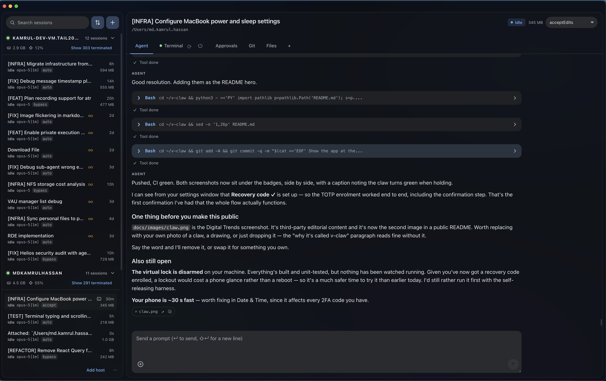
</p>

<p align="center">
  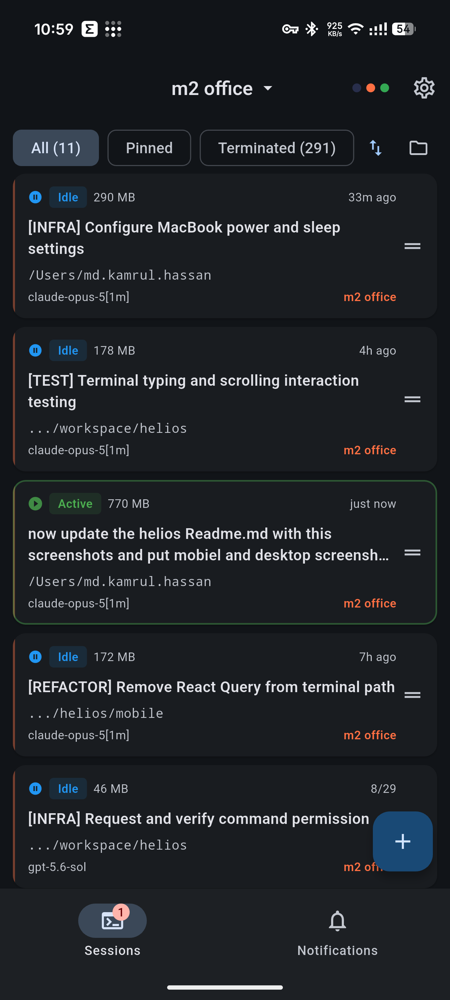
  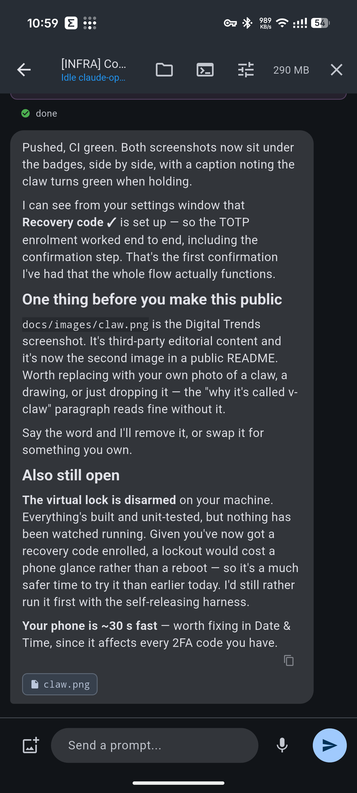
  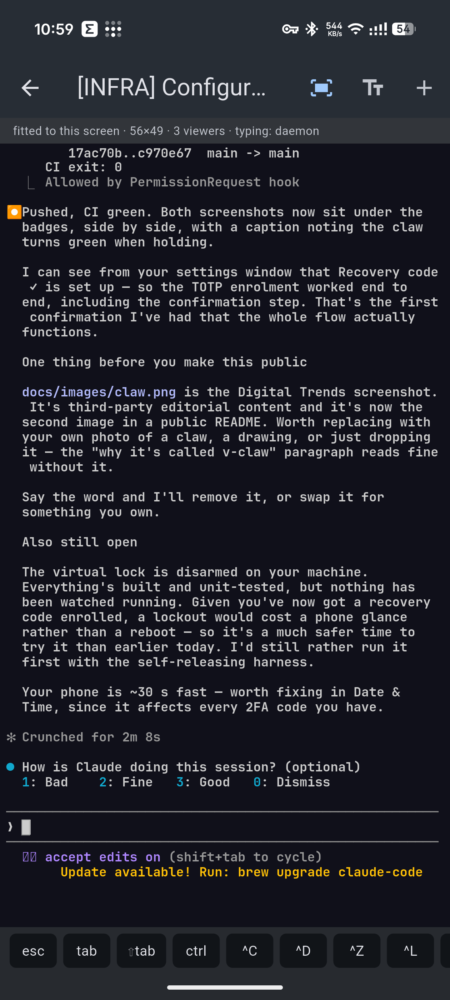
</p>

Claude Code, Codex and Aider are headless harnesses: they run in a terminal, on
your machine, with no UI of their own beyond the one terminal you started them
in. Helios is the head on top of them. It runs each harness in a terminal host
it owns, keeps the output in memory, and serves it to three surfaces:

- **Desktop app** — sidebar of every session on every machine, live terminal,
  chat transcript, git diffs, approvals, file tree
- **Mobile app** — the same sessions in your pocket, notified and approvable
  the moment a harness blocks on a permission
- **Tunnel** — nine providers, one keypress, so the phone reaches the daemon
  from anywhere without you configuring a network

The harness stays headless and stays local. Helios is the part you look at.

Claude Code is the harness wired up today, through its native hooks. Attaching
any other harness is a plugin: the provider registry in `internal/provider` is
the seam, and going forward every harness — Codex, Aider, Gemini CLI, your own
— plugs in there rather than being special-cased in the daemon.

## Install

```bash
git clone https://github.com/kamrul1157024/helios.git && cd helios

make install           # daemon + CLI  → /usr/local/bin/helios   (needs Go 1.26+)
make desktop-install   # desktop app   → /Applications/Helios.app (macOS, needs Node 20+)
make apk-install       # Android app   → the device on adb        (needs Flutter 3.32+)

helios start           # the TUI checks your setup and walks you through the rest
```

Only `make install` is required — the daemon is the product, and the apps are
clients for it. Everything after that happens in the TUI: pick a tunnel, show a
QR code, pair a device.

| Command | Builds | Installs to |
| --- | --- | --- |
| `make install` | Go binary | `/usr/local/bin/helios` |
| `make desktop-install` | Electron app | `/Applications/Helios.app` |
| `make desktop-app` | Electron app | `desktop/release/*.dmg` (no install) |
| `make apk-install` | Debug APK | the connected Android device |
| `make apk-release` | Release APK | `~/.helios/helios.apk` |

Pick one tunnel provider so your phone can reach the daemon —
`brew install tailscale` (recommended: private to your tailnet, stable hostname)
or `brew install cloudflared` (public URL, no account).

The full walkthrough, with screenshots of each step, is in the
[Setup Guide](#setup-guide) below.

---

You run 5 Claude sessions across 3 projects. One needs permission to run a test. Another finished refactoring and is waiting for your next instruction. A third hit a rate limit 20 minutes ago. You don't know any of this because you're in a different terminal tab.

Helios fixes this. It's a daemon that sits between you and your coding harness. It runs each session in a terminal of its own, watches for events via hooks, and notifies you the moment any session needs attention — in the TUI, on the desktop app, on your phone, wherever you are. It also narrates what your agents are doing in real time via voice reporting, so you can stay informed hands-free without watching the screen.

**The killer feature:** Full session management and notifications from your phone — see all sessions across multiple machines, approve or deny permissions, send follow-up messages, create new tasks, and get push notifications the moment any session needs attention. No terminal required.

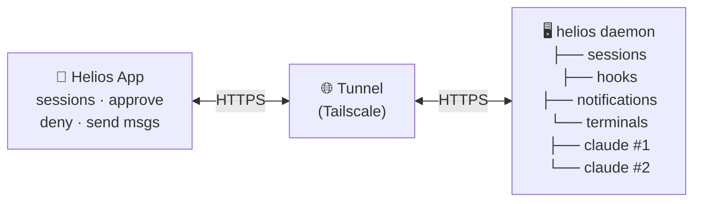
```mermaid
graph LR
    Phone["📱 Helios App<br/>sessions · approve<br/>deny · send msgs"]
    Tunnel["🌐 Tunnel<br/>(Tailscale)"]
    Daemon["🖥️ helios daemon<br/>├── sessions<br/>├── hooks<br/>├── notifications<br/>└── terminals<br/>    ├── claude #1<br/>    └── claude #2"]

    Phone <-->|HTTPS| Tunnel
    Tunnel <-->|HTTPS| Daemon
```

### Multi-Host & Multi-Device

Helios supports **many-to-many** connectivity between devices and machines:

- **Multiple hosts from one device** — connect your phone to your work laptop, home desktop, and cloud VM. All sessions from all machines appear in a single unified view, color-coded by host.
- **Multiple devices on one host** — pair your phone, tablet, and desktop app to the same machine. Each device gets independent push notifications and can manage sessions simultaneously.

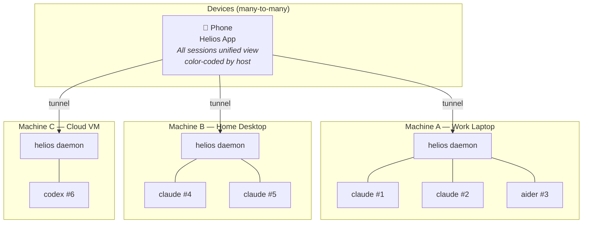
```mermaid
graph TB
    subgraph Devices["Devices (many-to-many)"]
        Phone["📱 Phone<br/>Helios App<br/><i>All sessions unified view<br/>color-coded by host</i>"]
    end

    subgraph MachineA["Machine A — Work Laptop"]
        DA["helios daemon"]
        DA --- C1["claude #1"]
        DA --- C2["claude #2"]
        DA --- A3["aider #3"]
    end

    subgraph MachineB["Machine B — Home Desktop"]
        DB["helios daemon"]
        DB --- C4["claude #4"]
        DB --- C5["claude #5"]
    end

    subgraph MachineC["Machine C — Cloud VM"]
        DC["helios daemon"]
        DC --- X6["codex #6"]
    end

    Phone -->|tunnel| DA
    Phone -->|tunnel| DB
    Phone -->|tunnel| DC
```

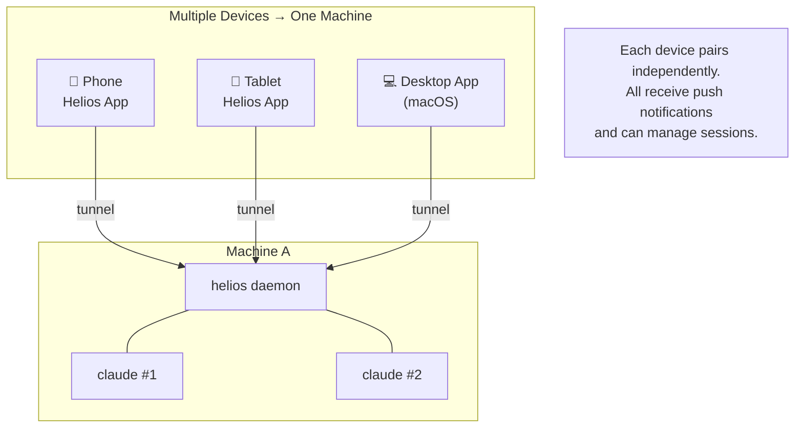
```mermaid
graph TB
    subgraph MultiDevice["Multiple Devices → One Machine"]
        Ph2["📱 Phone\nHelios App"]
        Tab["📱 Tablet\nHelios App"]
        Mac["💻 Desktop App\n(macOS)"]
    end

    subgraph MachineA2["Machine A"]
        DA2["helios daemon"]
        DA2 --- CC1["claude #1"]
        DA2 --- CC2["claude #2"]
    end

    Ph2 -->|tunnel| DA2
    Tab -->|tunnel| DA2
    Mac -->|tunnel| DA2

    note["Each device pairs independently.\nAll receive push notifications\nand can manage sessions."]
```

Each connection is fully independent — separate pairing, separate credentials, separate SSE streams. The app maintains live connections to all hosts in the background, routing actions (approve, deny, send message) to the correct machine automatically.

## Setup Guide

### Prerequisites

```bash
brew install go                     # Go (to build helios)

# Pick ONE tunnel provider — this is how your phone reaches helios:
brew install tailscale              # Tailscale (recommended) — or the Mac app from
                                    # https://tailscale.com/download
# or
brew install cloudflared            # Cloudflare Tunnel (public URL, changes on every restart)
# or
brew install ngrok                  # ngrok (free tier, requires signup at ngrok.com)
```

### Step 1 — Install the binary

```bash
$ make install
```

```
┌──────────────────────────────────────────────┐
│  $ make install                              │
│  go build -o helios ./cmd/helios/            │
│  helios installed to /usr/local/bin/helios   │
└──────────────────────────────────────────────┘
```

### Step 2 — Start helios

```bash
$ helios start
```

The TUI checks your environment and walks you through setup:

```
┌──────────────────────────────────────────────┐
│                                              │
│  helios                                      │
│                                              │
│    ✓ Daemon running                          │
│    ✓ Claude hooks installed                  │
│    ✗ No tunnel configured                    │
│    · No devices registered                   │
│                                              │
│    enter continue  q quit                    │
│                                              │
└──────────────────────────────────────────────┘
```

### Step 3 — Pick a tunnel

Your phone needs a way to reach your machine. Pick a tunnel provider:

```
┌────────────────────────────────────────────────────────────┐
│                                                            │
│  helios — Tunnel Setup                                     │
│                                                            │
│    How will your phone connect?                            │
│                                                            │
│    > Tailscale Serve (recommended)            ready        │
│        Private to your tailnet. Needs the Tailscale VPN    │
│        switched ON on your phone.                          │
│      Tailscale Funnel                         ready        │
│      Cloudflare Tunnel                        needs setup  │
│      zrok (open-source, stable URLs)          needs setup  │
│      ngrok                                    needs setup  │
│      localtunnel (zero signup)                needs setup  │
│      localhost.run (no install — uses SSH)    ready        │
│      localxpose (regional, reserved domains)  needs setup  │
│      Local Network (no HTTPS)                 ready        │
│      Custom URL                               ready        │
│                                                            │
│    ↑/↓ navigate  enter select  q quit                      │
│                                                            │
└────────────────────────────────────────────────────────────┘
```

The right-hand column is checked live, so a provider that needs a login or an
install says so before you pick it.

**Tailscale Serve is the recommendation.** It keeps the daemon inside your
tailnet — nothing is published to the internet, the hostname never changes
between restarts, and there is no certificate to manage. The cost is that the
Tailscale VPN has to be switched on at the phone end.

Pick **Tailscale Funnel** instead if you want a stable URL reachable without
the VPN. Funnel is public, and it needs HTTPS certificates enabled for the
tailnet, which publishes this machine's name to public Certificate Transparency
logs. Serve does not.

Everything else is a public tunnel. Cloudflare is the easiest of them — no
account — but its URL changes on every restart, so every paired device has to
be re-pointed.

### Step 4 — Main dashboard with QR codes

Once the tunnel connects, the dashboard shows two QR codes:

```
┌──────────────────────────────────────────────────────────┐
│                                                          │
│  helios                                                  │
│                                                          │
│    ✓ Daemon running                                      │
│    ✓ Claude hooks installed                              │
│    ✓ Tunnel: https://macbook.tail4c2f.ts.net             │
│                                                          │
│    · No devices connected yet.                           │
│                                                          │
│    Download app:                                         │
│    ┌─────────────────────────────────┐                   │
│    │  ▄▄▄▄▄▄▄ ▄▄ ▄ ▄▄▄▄ ▄▄▄▄▄▄▄    │                   │
│    │  █ ▄▄▄ █ ▄▀██▀▄▀▄  █ ▄▄▄ █    │  ← scan with      │
│    │  █ ███ █ ▀█▄▀ ▀█ ▄ █ ███ █    │    phone camera    │
│    │  █▄▄▄▄▄█ ▄ █▄▀ █ ▄ █▄▄▄▄▄█    │    to download     │
│    │  ▄▄▄▄▄ ▄▄▄▀▄ ▄▀  ▄ ▄ ▄ ▄ ▄    │    the app         │
│    │  █▄▄▄▄▄█ ▀▄▀▄ ▀▄  █▄▄▄▄▄▄█    │                   │
│    │  ▀▀▀▀▀▀▀ ▀ ▀▀ ▀ ▀▀ ▀▀▀▀▀▀▀    │                   │
│    └─────────────────────────────────┘                   │
│    https://macbook.tail4c2f.ts.net                       │
│                                                          │
│    Pair a new device:                                    │
│    ┌─────────────────────────────────┐                   │
│    │  ▄▄▄▄▄▄▄ ▄ ▄▄ ▄▄▄  ▄▄▄▄▄▄▄    │                   │
│    │  █ ▄▄▄ █ █▀▀▄█ █▀▄ █ ▄▄▄ █    │  ← scan from      │
│    │  █ ███ █ ██▀▄ ▀ ▀▄ █ ███ █    │    inside the      │
│    │  █▄▄▄▄▄█ █ ▀▄█▄█ ▄ █▄▄▄▄▄█    │    helios app      │
│    │  ▄▄  ▄ ▄▄▄▀ ▀▄▄ ▄▄ ▄ ▄ ▄ ▄    │                   │
│    │  █▄▄▄▄▄█ ▄▀▀█▄ ▀█  █▄▄▄▄▄▄█    │                   │
│    │  ▀▀▀▀▀▀▀ ▀▀ ▀ ▀▀▀  ▀▀▀▀▀▀▀    │                   │
│    └─────────────────────────────────┘                   │
│    Expires in 1:42  (auto-refreshes)                     │
│                                                          │
│    q quit                                                │
│                                                          │
└──────────────────────────────────────────────────────────┘
```

### Step 5 — Download the app (QR 1)

Scan the **Download QR** with your phone camera. It opens a landing page:

```
┌─────────────────────────┐
│ ┌─────────────────────┐ │
│ │ ◀  abc.trycloudfl.. │ │
│ └─────────────────────┘ │
│                         │
│                         │
│         Helios          │
│  Orchestrate AI coding  │
│  agents from your phone │
│                         │
│  ┌───────────────────┐  │
│  │                   │  │
│  │  Download for     │  │
│  │  Android          │  │
│  │  APK              │  │
│  │                   │  │
│  └───────────────────┘  │
│                         │
│  ┌───────────────────┐  │
│  │                   │  │
│  │  Download for     │  │
│  │  macOS            │  │
│  │  DMG              │  │
│  │                   │  │
│  └───────────────────┘  │
│                         │
│  ┌───────────────────┐  │
│  │ How to connect    │  │
│  │ 1. Download app   │  │
│  │ 2. Run helios     │  │
│  │    start          │  │
│  │ 3. Scan pairing   │  │
│  │    QR code        │  │
│  └───────────────────┘  │
│                         │
└─────────────────────────┘
```

### Step 6 — Pair your device (QR 2)

Open the Helios app and scan the **Pairing QR**:

```
┌─────────────────────────┐
│          helios          │
│                         │
│  ┌───────────────────┐  │
│  │                   │  │
│  │                   │  │
│  │   ┌───────────┐   │  │
│  │   │           │   │  │
│  │   │  CAMERA   │   │  │
│  │   │ VIEWFINDER│   │  │
│  │   │           │   │  │
│  │   │   [ ]     │   │  │
│  │   │           │   │  │
│  │   └───────────┘   │  │
│  │                   │  │
│  │                   │  │
│  └───────────────────┘  │
│                         │
│  Scan the QR code from  │
│  your terminal          │
│                         │
│  Run helios start in    │
│  your terminal to       │
│  generate a QR code     │
│                         │
│  Paste URL manually     │
│                         │
└─────────────────────────┘
```

### Step 7 — Approve the device

The app registers and waits. The terminal asks you to confirm:

```
┌─────────────────────────┐          ┌──────────────────────────────────────────────┐
│                         │          │                                              │
│  ┌───────────────────┐  │          │  helios — New Device                         │
│  │                   │  │          │                                              │
│  │  helios           │  │          │    A device wants to pair:                   │
│  │  Setting up...    │  │          │                                              │
│  │                   │  │          │      Name:     Android — Helios App          │
│  │  + Generating     │  │          │      Platform: Android                       │
│  │    keys...        │  │          │      KID:      a1b2c3d4-e5f6                 │
│  │  + Registering    │  │          │                                              │
│  │    device...      │  │          │    Allow this device?                        │
│  │  + Authenticating │  │          │                                              │
│  │  + Waiting for    │  │          │    y approve  n reject                       │
│  │    approval...    │  │          │                                              │
│  │                   │  │          └──────────────────────────────────────────────┘
│  │  ┌─────────────┐  │  │
│  │  │  Press "y"  │  │  │                       press y
│  │  │ in terminal │  │  │                          │
│  │  │ to approve  │  │  │                          ▼
│  │  └─────────────┘  │  │
│  │                   │  │          ┌──────────────────────────────────────────────┐
│  │       ⟳           │  │          │  helios                                      │
│  │                   │  │          │                                              │
│  └───────────────────┘  │          │    ✓ Daemon running                          │
│                         │          │    ✓ Claude hooks installed                  │
└─────────────────────────┘          │    ✓ Shell wrapper (zsh)                     │
                                     │    ✓ Tunnel: https://macbook.tail4c2f...     │
        Phone                        │                                              │
                                     │    * Android — Helios App  push:on  just now │
                                     │                                              │
                                     └──────────────────────────────────────────────┘

                                                    Terminal
```

### Step 8 — You're in

The app navigates to the dashboard. Start a session and control Claude from your phone:

```bash
$ helios new "fix the auth bug in login.go"
```

```
┌──────────────────────────────────────────────┐
│  Session a3f1c2e8 started                    │
│    cwd: /Users/you/workspace/myapp           │
│    Attach with: helios attach a3f1c2e8       │
└──────────────────────────────────────────────┘
```

Claude asks for permission → your phone buzzes → you tap approve → Claude continues:

<p align="center">
  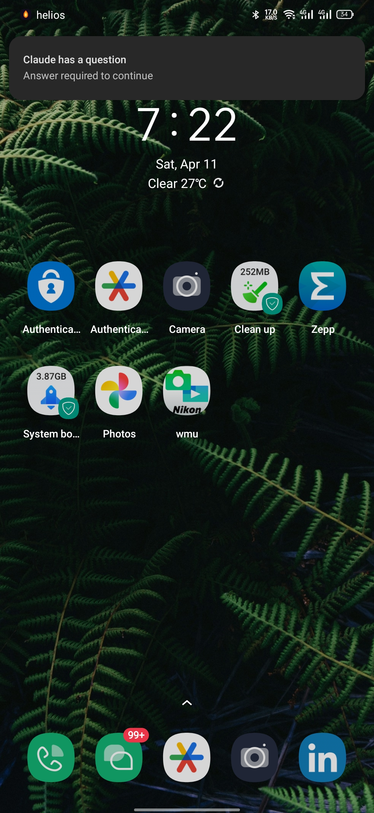
  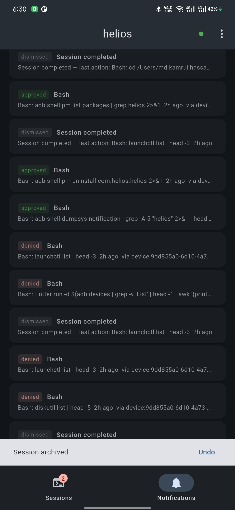
  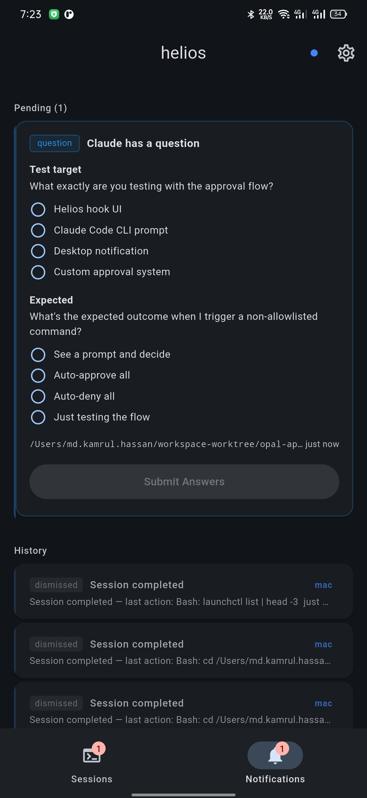
</p>

Open the app to see every session across every paired host, drill into a live
transcript, and switch the permission mode — all from your phone:

<p align="center">
  
  
  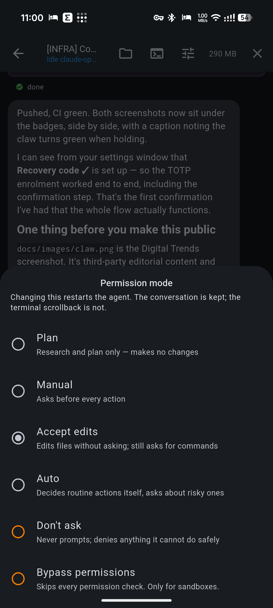
</p>

The phone is not a read-only mirror. It carries the same terminal the desktop
app attaches to, the session's git worktrees, and its files:

<p align="center">
  
  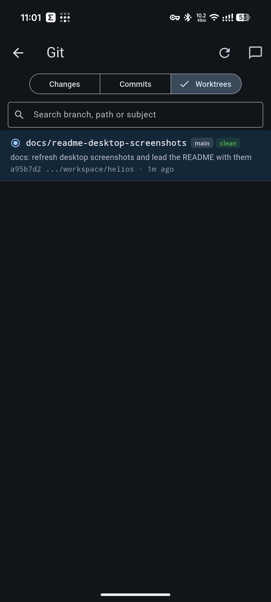
  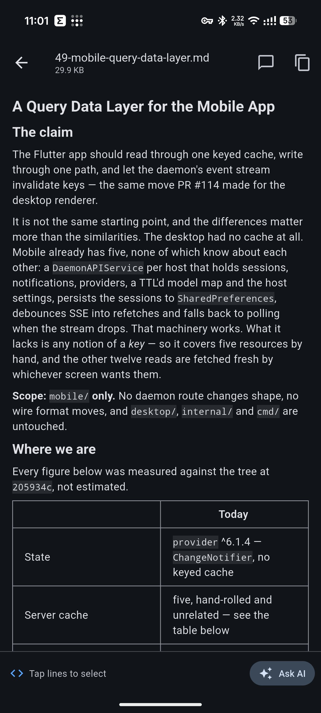
</p>

## Desktop app

`make desktop-install` builds the Electron app and drops it in `/Applications`.
Prebuilt packages — DMGs for Apple silicon and Intel, an AppImage and a `.deb` —
are attached to every
[release](https://github.com/kamrul1157024/helios/releases/latest), and the
daemon's landing page links to them.

On first launch the app pairs itself with the daemon on the same machine — no QR
code, no token — and `Add host` in the sidebar pairs it with the remote ones the
same way the phone does.

The sidebar lists every session on every paired host with its live status. The
right side is the selected session, across five tabs:

**Chat** — the transcript, rendered, with a prompt box. The header carries the
session status, the permission mode (switchable inline), and a shortcut to the
terminal.

<p align="center">
  
</p>

Every tool call collapses to one line and expands in place, so a long run of
commands stays readable and you can still open the exact output you care about.

<p align="center">
  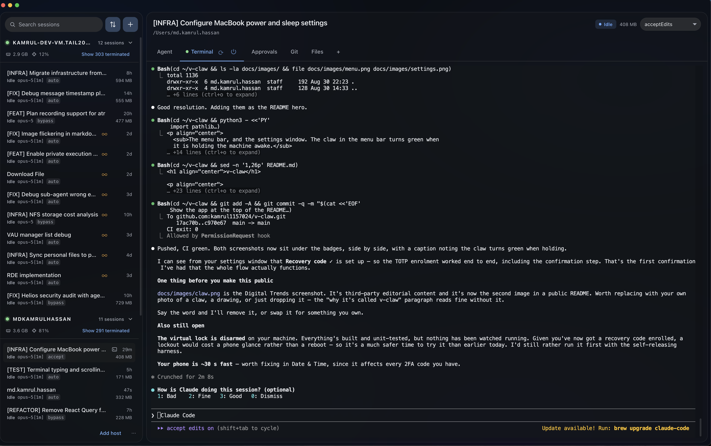
</p>

**Files** — the session's working tree with a file viewer, tabs and search.
**Terminal** is the real Claude TUI attached over the daemon, **Git** covers
uncommitted changes, branches and worktrees, and **Approvals** holds the
pending permission requests.

<p align="center">
  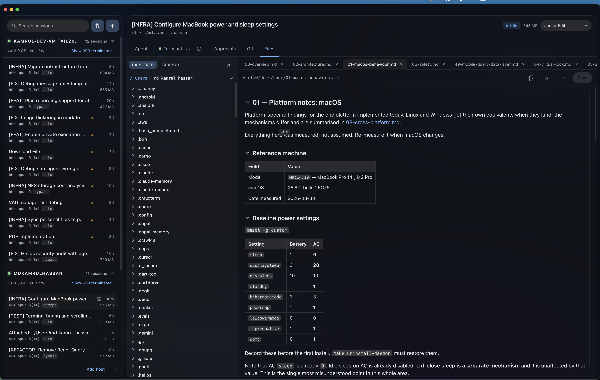
</p>

## What is this?

Helios is the **head** for headless agent harnesses. The agents keep running on
your hardware in terminals; Helios owns those terminals and puts a UI in front
of them. Everything except the AI itself is free.

- **Daemon** — a background process that manages terminal-hosted sessions, handles AI hooks, serves an HTTP API with SSE for real-time events, and routes notifications
- **Clients** — desktop app, mobile app, TUI and CLI, all stateless, all interchangeable, all talking to the same daemon over HTTP. Use one, use all, use none
- **Harness plugins** — Claude Code is the implemented provider, with native hook integration. Any other terminal-run harness attaches through the same registry (`internal/provider`): hooks, actions, commands, models and capabilities are all registered, not hard-coded
- **Tunnel** — nine providers behind one picker: Tailscale Serve and Funnel, Cloudflare, zrok, ngrok, localtunnel, localhost.run, localxpose, plus plain LAN and a custom URL
- **Notifications** — the desktop app raises native alerts and answers them in place: an approval opens a HUD with the tool call and the same controls the phone has. On-device notifications on the phone are driven off the same SSE stream — no push service, no third-party relay
- **Voice reporting** — Helios narrates what your agents are doing in real time: tool calls, permission requests, completions, and errors — spoken aloud so you can stay informed without watching the screen. Narration is AI-generated on the backend and streamed to your phone via SSE. You control what you hear and how you hear it: choose any system TTS voice, set speech rate and pitch, and pick a persona that styles the narration (Default, Butler, Casual, GenZ, or Sarcastic). This is session activity reporting — not AI responses read back to you

## Why?

AI coding agents are becoming the primary way developers work. But the tooling around them is stuck in "one terminal, one session, stare at it." That breaks down when you:

- Run multiple sessions and lose track of which ones need you
- Step away and miss a permission prompt that blocks everything
- Want to check on your AI's progress from your phone
- Need to approve 6 permissions across 3 sessions — one at a time, manually
- Want to hand a session a new task without context-switching back to the terminal

Helios treats AI sessions like infrastructure — something to be managed, monitored, and orchestrated, not babysat.

## Architecture

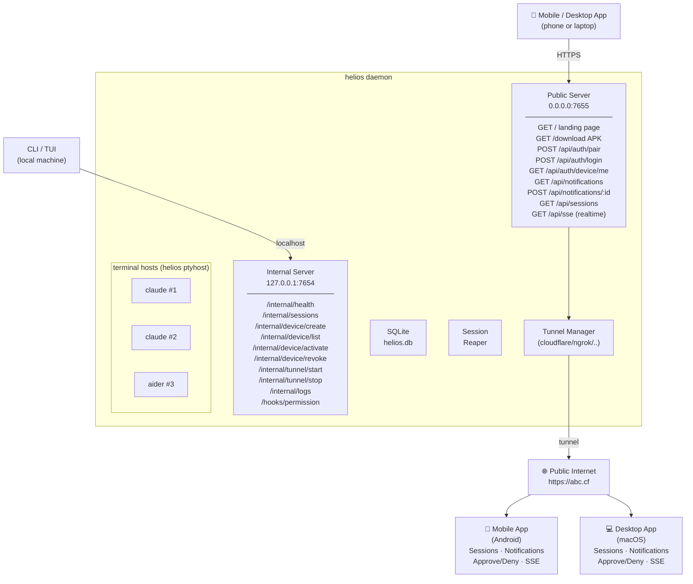
```mermaid
graph TB
    CLI["CLI / TUI\n(local machine)"]
    Mobile["📱 Mobile / Desktop App\n(phone or laptop)"]

    subgraph Daemon["helios daemon"]
        Internal["Internal Server\n127.0.0.1:7654\n─────────────────\n/internal/health\n/internal/sessions\n/internal/device/create\n/internal/device/list\n/internal/device/activate\n/internal/device/revoke\n/internal/tunnel/start\n/internal/tunnel/stop\n/internal/logs\n/hooks/permission"]

        Public["Public Server\n0.0.0.0:7655\n─────────────────\nGET  /  landing page\nGET  /download  APK\nPOST /api/auth/pair\nPOST /api/auth/login\nGET  /api/auth/device/me\nGET  /api/notifications\nPOST /api/notifications/:id\nGET  /api/sessions\nGET  /api/sse  (realtime)"]

        SQLite["SQLite\nhelios.db"]
        Reaper["Session\nReaper"]
        Tunnel["Tunnel Manager\n(cloudflare/ngrok/..)"]

        subgraph hosts["terminal hosts (helios ptyhost)"]
            S1["claude #1"]
            S2["claude #2"]
            S3["aider #3"]
        end
    end

    Internet["🌐 Public Internet\nhttps://abc.cf"]
    MobileApp["📱 Mobile App\n(Android)\nSessions · Notifications\nApprove/Deny · SSE"]
    DesktopApp["💻 Desktop App\n(macOS)\nSessions · Notifications\nApprove/Deny · SSE"]

    CLI -->|localhost| Internal
    Mobile -->|HTTPS| Public
    Public --> Tunnel
    Tunnel -->|tunnel| Internet
    Internet --> MobileApp
    Internet --> DesktopApp
```

```
┌─────────────────────────────────────────┐
│           File Layout (~/.helios/)       │
│                                         │
│  ~/.helios/                             │
│  ├── config.yaml      ← server config  │
│  ├── helios.db        ← SQLite (devices,│
│  │                      sessions, etc.) │
│  ├── daemon.pid       ← running PID    │
│  ├── helios.apk       ← built APK copy │
│  └── logs/                              │
│      └── daemon.log   ← daemon logs    │
│                                         │
│  ~/.claude/settings.json                │
│      └── hooks: [...helios hooks...]    │
│                                         │
└─────────────────────────────────────────┘
```

## Status

Shipping — latest tag is `v1.5.5`, with binaries, DMGs, AppImage, `.deb` and
APK attached to each
[release](https://github.com/kamrul1157024/helios/releases/latest). Design
documents live in `docs/specs/`; they lead the code, so read them for intent
rather than as a description of what is merged.

## Spec Documents

| Doc | Description |
|-----|-------------|
| [01-concept.md](docs/specs/01-concept.md) | Vision, problem statement, design principles |
| [02-tui-design.md](docs/specs/02-tui-design.md) | TUI layout, sidebar, tabs, mouse support |
| [03-notifications.md](docs/specs/03-notifications.md) | Notification system: hooks, toasts, panel, OS alerts |
| [04-architecture.md](docs/specs/04-architecture.md) | Components, state machine, directory structure |
| [05-cli-interface.md](docs/specs/05-cli-interface.md) | CLI commands, keybindings, suspend/resume flow |
| [06-claude-hooks-reference.md](docs/specs/06-claude-hooks-reference.md) | Claude Code hooks API reference |
| [07-ui-improvements-roadmap.md](docs/specs/07-ui-improvements-roadmap.md) | UI feature roadmap (v0.1, v0.2) |
| [08-design-decisions.md](docs/specs/08-design-decisions.md) | Technology choices, open questions |
| [09-prerequisites-and-health-checks.md](docs/specs/09-prerequisites-and-health-checks.md) | Startup checks, `helios doctor` |
| [10-tmux-resurrect-integration.md](docs/specs/10-tmux-resurrect-integration.md) | Superseded by spec 29 — sessions now survive on their own |
| [11-notification-page.md](docs/specs/11-notification-page.md) | Full-screen notification page, batch approve/deny |
| [12-auto-approve.md](docs/specs/12-auto-approve.md) | Per-session auto-approve modes and custom rules |
| [13-notification-channels-and-plugins.md](docs/specs/13-notification-channels-and-plugins.md) | Channel plugin system, mobile push |
| [14-remote-commands.md](docs/specs/14-remote-commands.md) | Send messages, create sessions, manage fleet remotely |
| [15-daemon-architecture.md](docs/specs/15-daemon-architecture.md) | Daemon vs client separation, hook integration |
| [16-http-api.md](docs/specs/16-http-api.md) | HTTP API + SSE protocol |
| [17-naming.md](docs/specs/17-naming.md) | Naming decision: helios |
| [18-provider-interface.md](docs/specs/18-provider-interface.md) | AI provider plugin interface, capabilities, detection |
| [19-flow-diagrams.md](docs/specs/19-flow-diagrams.md) | 13 detailed flow diagrams for all major operations |
| [20-remote-access-and-auth.md](docs/specs/20-remote-access-and-auth.md) | Remote access, JWT auth, QR setup, web frontend |
| [21-channel-protocol.md](docs/specs/21-channel-protocol.md) | Channel HTTP protocol, registration, proxy routing, SQLite state |
| [22-session-management-and-remote-control.md](docs/specs/22-session-management-and-remote-control.md) | Remote session lifecycle and control surface |
| [22-setup-and-security.md](docs/specs/22-setup-and-security.md) | Setup flow and the security model behind pairing |
| [23-rich-approval-hitl.md](docs/specs/23-rich-approval-hitl.md) | Rich human-in-the-loop approval cards |
| [24-session-management-tmux.md](docs/specs/24-session-management-tmux.md) | Superseded by spec 29 |
| [25-device-generated-keys.md](docs/specs/25-device-generated-keys.md) | Device-side Ed25519 keygen, no key ever leaves the phone |
| [26-session-status-fixes.md](docs/specs/26-session-status-fixes.md) | Session status derivation fixes |
| [27-bearer-auth-remove-cookies.md](docs/specs/27-bearer-auth-remove-cookies.md) | Bearer-token auth, cookies dropped |
| [28-managed-session-recovery.md](docs/specs/28-managed-session-recovery.md) | Managed sessions and auto-recovery after a crash |
| [29-terminal-host-replacing-tmux.md](docs/specs/29-terminal-host-replacing-tmux.md) | `helios ptyhost` replacing tmux as the session backend |
| [30-tailscale-transport.md](docs/specs/30-tailscale-transport.md) | Tailscale Serve/Funnel as the recommended transport |
| [31-desktop-app.md](docs/specs/31-desktop-app.md) | Electron desktop client: sidebar, tabs, multi-host |
| [32-mobile-notification-lifecycle.md](docs/specs/32-mobile-notification-lifecycle.md) | Notification lifecycle on the phone |
| [33-session-error-retry.md](docs/specs/33-session-error-retry.md) | Error states and retry behaviour |
| [34-askuserquestion-dual-answer.md](docs/specs/34-askuserquestion-dual-answer.md) | Handling `AskUserQuestion` from two surfaces at once |
| [35-git-history-and-worktrees.md](docs/specs/35-git-history-and-worktrees.md) | Git history, worktrees and branch review |

Topic specs, not numbered: [multi-host](docs/specs/multi-host-spec.md),
[voice mode](docs/specs/voice-mode.md), [AI narration](docs/specs/ai-narration.md),
[reporter](docs/specs/reporter.md),
[desktop notifications](docs/specs/desktop-notification-service.md),
[alert settings](docs/specs/notification-alert-settings.md),
[session search](docs/specs/session-search-and-group-by-directory.md),
[tunnel decoupling](docs/specs/spec-tunnel-decoupling.md) and one spec per
tunnel provider.

## CLI

```bash
helios start                    # TUI: status, tunnel picker, pairing QR codes
helios new "refactor auth"      # create a session
helios sessions                 # list sessions
helios attach a3f1c2e8          # attach to a session's terminal
helios devices                  # list / approve / revoke paired devices
helios tunnel                   # start, stop or inspect the tunnel
helios logs                     # tail the daemon log
helios stop                     # stop the daemon
```

## Tech Stack

- **Daemon / CLI / TUI**: Go
- **Mobile**: Flutter (Android, iOS)
- **Desktop**: Electron + TypeScript, packaged with electron-builder (DMG, AppImage, deb)
- **Session backend**: Helios terminal hosts (`helios ptyhost`)
- **Real-time**: SSE
- **Auth**: Asymmetric JWT (Ed25519), QR code device pairing
- **Harness integration**: Claude Code hooks (native); other harnesses via the provider plugin registry
- **Desktop notifications**: the desktop app (Electron), no external binaries
- **Voice reporting**: AI-generated narration streamed from backend (SSE), Flutter TTS with configurable voice, rate, pitch, and persona
- **Everything runs locally. No cloud. No subscriptions. No accounts.**

## Requirements

- Go 1.26+ (the version in go.mod)
- A headless coding harness — Claude Code today
- Node 20+ (only to build the desktop app from source)
- Flutter 3.32+ (only to build the mobile app from source)

## License

[Elastic License 2.0 (ELv2)](LICENSE)
