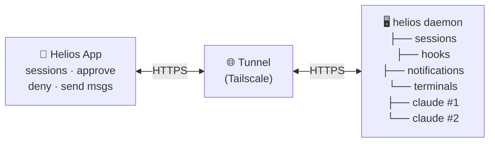
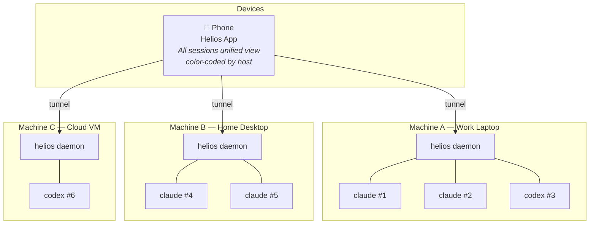
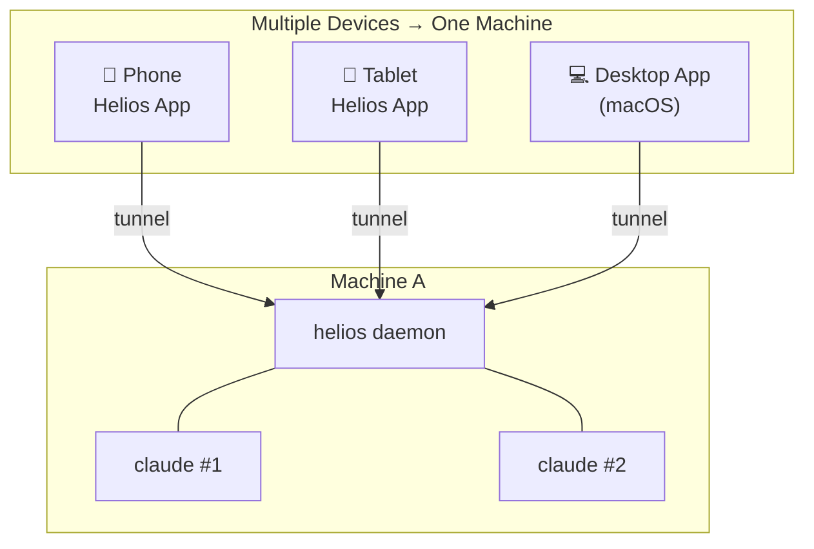
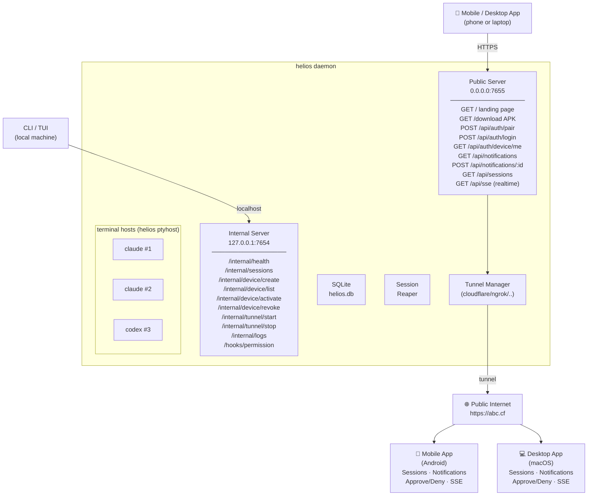

# Architecture

Helios is one daemon and a set of interchangeable clients. The daemon owns the
terminals the harness runs in; every client reads the same state over HTTP.

## Parts

- **Daemon** — manages terminal-hosted sessions, handles harness hooks, serves an HTTP
  API with SSE for real-time events, and routes notifications.
- **Clients** — desktop app, mobile app, TUI and CLI. All stateless, all talking to the
  same daemon over HTTP.
- **Harness plugins** — Claude Code and OpenAI Codex are implemented, both with native
  hook integration. Another terminal-run harness attaches through the registry in
  `internal/provider`: hooks, actions, commands, models and capabilities are registered,
  not hard-coded.
- **Tunnel** — nine providers behind one picker: Tailscale Serve and Funnel, Cloudflare,
  zrok, ngrok, localtunnel, localhost.run, localxpose, plus plain LAN and a custom URL.
- **Notifications** — the desktop app raises native alerts and answers them in place: an
  approval opens a HUD with the tool call and the same controls the phone has. Phone
  notifications come off the same SSE stream — no push service, no third-party relay.
- **Voice reporting** — narration of tool calls, permission requests, completions and
  errors, generated on the backend and streamed to the phone over SSE. The phone speaks
  it with system TTS; voice, rate, pitch and persona are settings. This narrates session
  activity, it does not read AI answers back to you.

## Phone to daemon



## Many hosts, many devices

One device can hold connections to several machines at once, and one machine can serve
several devices. Every connection is separate: its own pairing, its own credentials, its
own SSE stream. The app keeps all of them live and routes each approve, deny or message
to the machine the session belongs to.





## Inside the daemon



The internal server binds to localhost and is what the CLI and the harness hooks talk
to. The public server is the only one the tunnel exposes.

## On disk

```
~/.helios/
├── config.yaml      ← server config
├── helios.db        ← SQLite (devices, sessions, etc.)
├── daemon.pid       ← running PID
├── helios.apk       ← built APK copy
└── logs/
    └── daemon.log   ← daemon logs

~/.claude/settings.json
└── hooks: [...helios hooks...]
```

## Built with

- **Daemon, CLI and TUI** — Go
- **Mobile** — Flutter (Android, iOS)
- **Desktop** — Electron and TypeScript, packaged with electron-builder (DMG, AppImage,
  deb)
- **Session backend** — Helios terminal hosts (`helios ptyhost`)
- **Real-time** — SSE
- **Auth** — asymmetric JWT (Ed25519), QR code device pairing
- **Harness integration** — Claude Code and OpenAI Codex hooks, native
- **Voice** — backend narration over SSE, Flutter TTS on the phone

Everything runs on your machine. No cloud, no accounts, no subscription.
